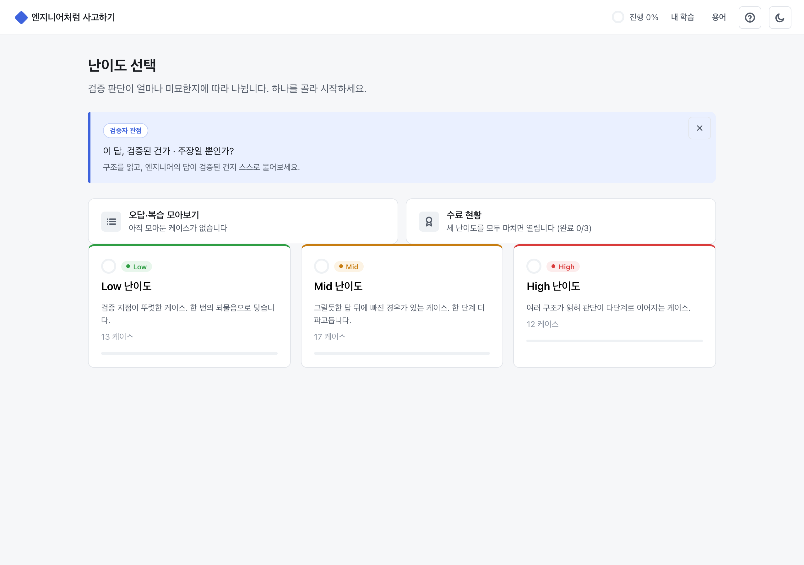
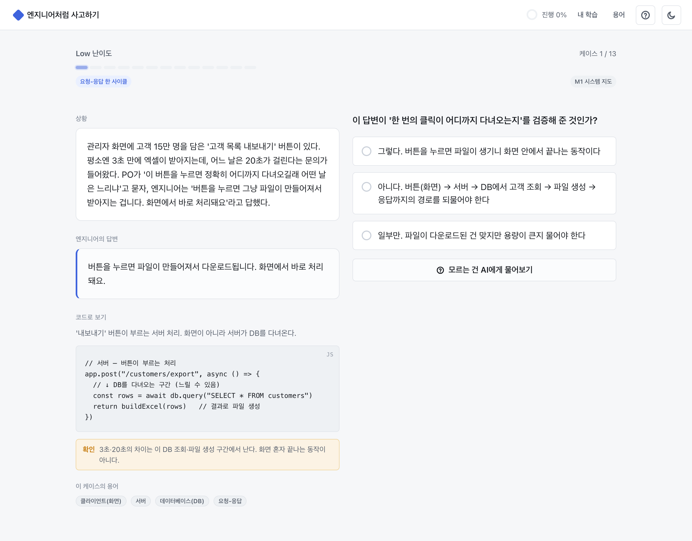
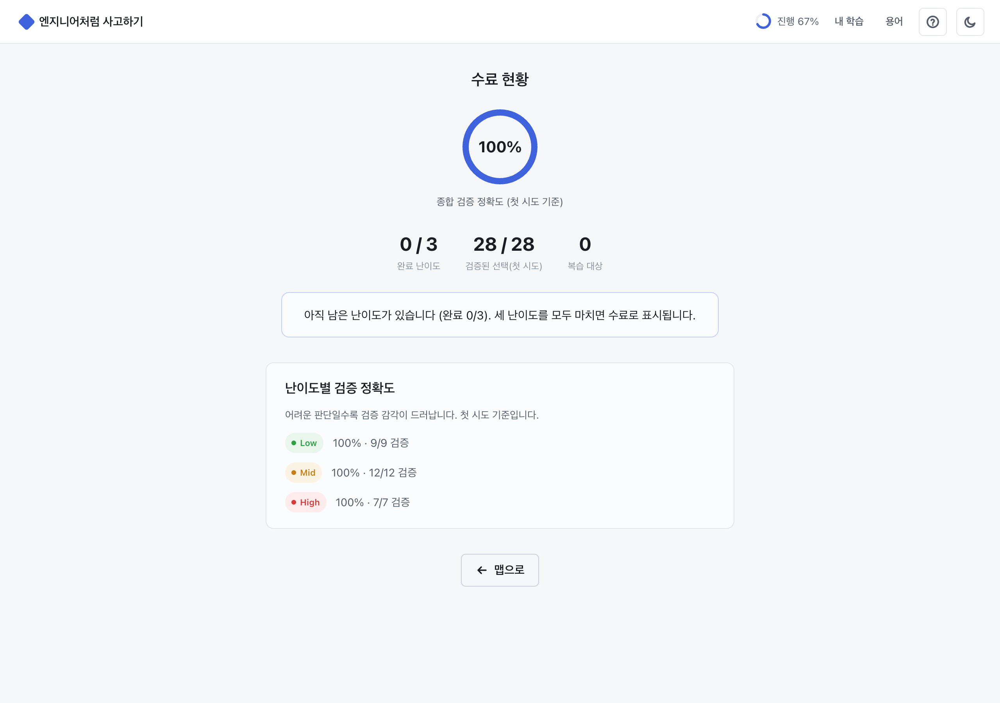

# 엔지니어처럼 사고하기

비개발자가 시스템 구조를 읽고, 엔지니어의 답이 "검증된 것"인지 "주장일 뿐"인지 가려내는 사고 방식을 케이스로 익히는 웹 게임.

**바로 플레이 → https://hyjjoo0623.github.io/engineer-mindset-game/**

## 어떻게 하나

- 시작할 때 난이도(Low·Mid·High)를 고르고, 그 난이도의 케이스를 순서대로 풉니다.
- 상황과 엔지니어의 답변을 보고 검증자로서 옳은 판단을 고릅니다.
- 제출하면 모든 선택지의 정오와 이유가 뜨고, "해설 보기"로 개념·검증 액션·화면·서버·DB 구조 도식을 봅니다.
- 모르는 건 그 자리에서 AI에게 물어보고, 필수 용어는 용어 사전에서 확인합니다.

## 특징

- 단일 HTML 파일, 외부 의존 없음. 브라우저에서 바로 동작합니다.
- 케이스는 난이도에 맞춰 생성해 확장하는 뱅크(현재 42개, 3·4지선다 혼합).
- 세 난이도를 모두 마치면 수료 대시보드에서 난이도별 검증 정확도를 봅니다.

